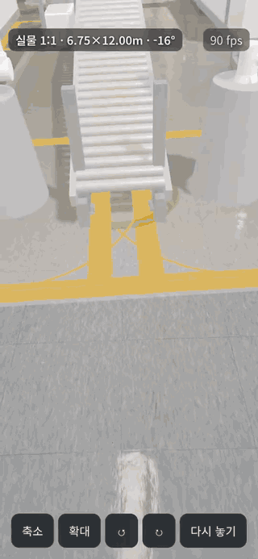
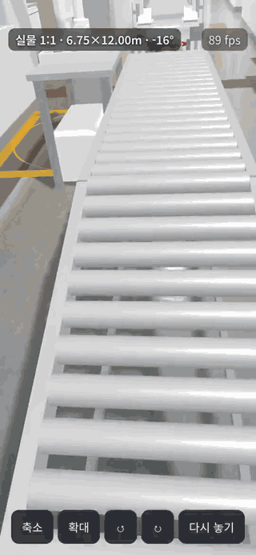
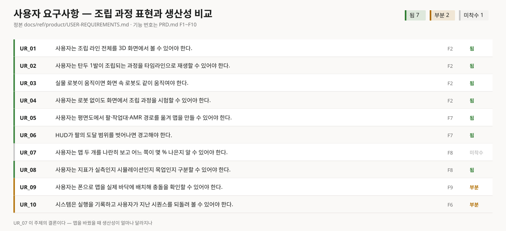
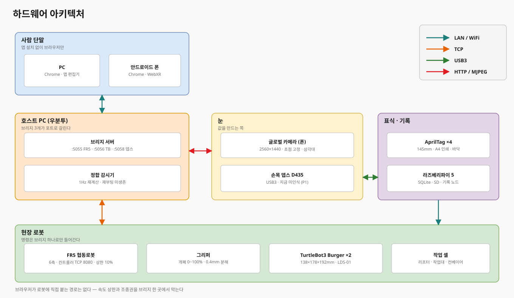
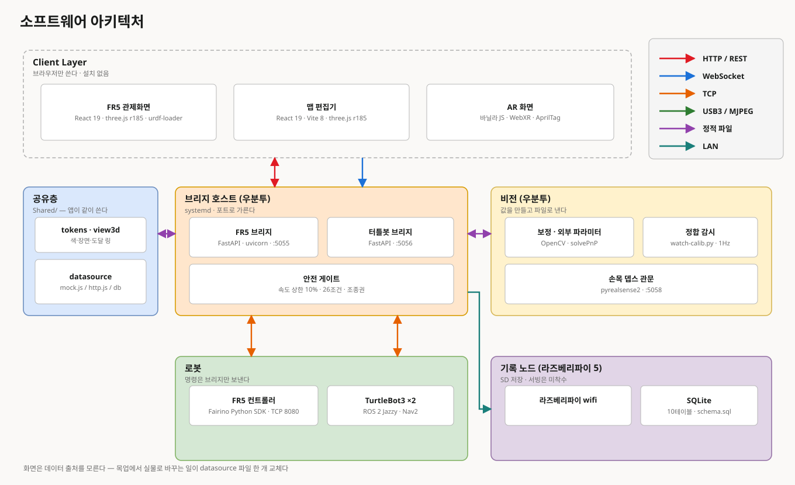
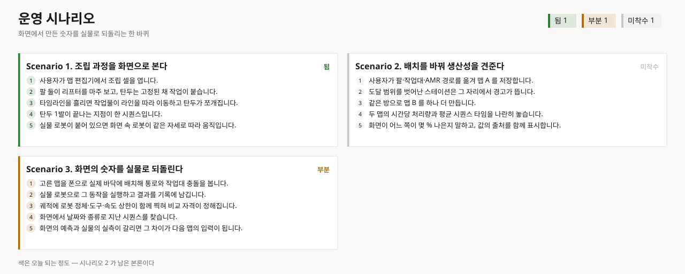
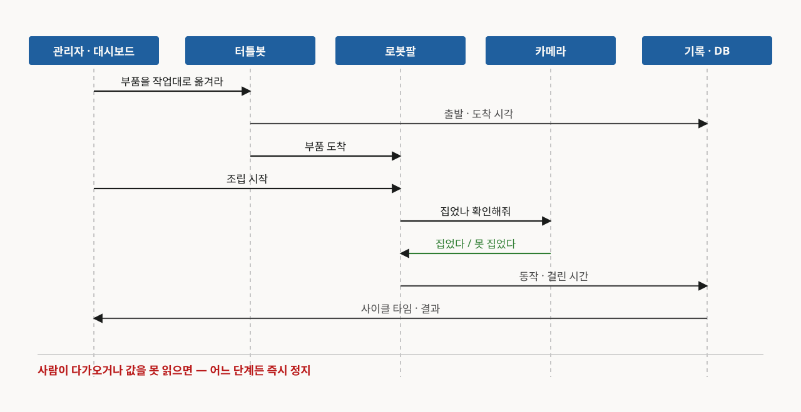
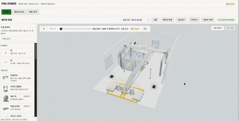
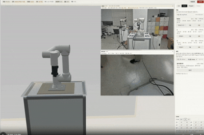
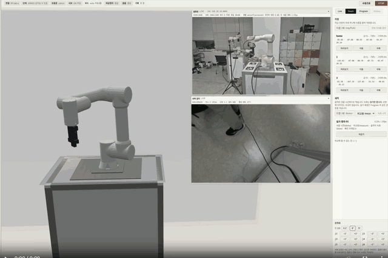

# FR5AR — 조립 라인 시각화 웹 작업대

> 방산 탄두 조립 과정을 디지털트윈으로 표현하고, 로봇이 움직이는 방식에 따라
> 생산성이 얼마나 달라지는지 눈으로 보게 만드는 웹 작업대.
> **Aegis Robotics** 4인 팀 프로젝트 — 이 저장소는 그중 **맵 편집 · AR · FR5 관제 · 비전 정합**을 맡는다.

## 지금 폰으로 바로 열어보기

**https://web-nine-rho-89.vercel.app/xr.html**

설치도 로그인도 없다. 모드와 맵을 고르고 **AR 시작**을 누른 뒤 바닥을 탭하면,
로봇 셀 맵이 실물 크기로 그 자리에 선다. AR은 안드로이드 크롬에서 열리고,
폰이 없어도 **화면 모드**로 같은 맵을 눈높이에서 둘러볼 수 있다.

  
  &nbsp;
  

실물 1:1 모드 — 조립 라인이 복도 바닥에 서고(왼쪽), 그 안으로 걸어 들어간다(오른쪽). 배포본에서 촬영.

지금 문제는 로봇 앞에 앉은 한 사람만 화면을 쓸 수 있다는 것. 배치를 바꿔 보고,
생산성을 견주고, 그 결과를 폰으로 실물 바닥에 겹쳐 확인하는 일까지를
앱 설치 없이 브라우저에서 해결한다.

## 사용자 요구사항

핵심은 마지막 한 줄 — 맵(배치안)을 바꿨을 때 생산성이 얼마나 달라지는지.
이 숫자가 프로젝트의 결론이고, 나머지 화면들은 전부 그 숫자로 가는 길이다.

## 시스템 아키텍처

현장 장비 · 눈(카메라) · 호스트 · 사람 단말 넷으로 갈린다.
로봇으로 가는 길은 브리지 하나뿐이다 — 속도 상한과 조종권 충돌을 한 곳에서 막는다.

가운데 데이터 출처 격리가 이 구조의 핵심이다. 화면은 목업을 읽는지 팀원 API를
읽는지 모른다. 그래서 나중에 실물 데이터를 붙이는 일이 파일 한 개 교체로 끝난다.

## 운영 시나리오

화면에서 조립 과정을 보고 → 배치를 바꿔 견주고 → 동작을 바꿔 견주고 → 그 숫자를
실물로 되돌린다. 네 시나리오가 한 바퀴다.

## 기능

### 맵 편집기

three.js로 만든 배치 편집 화면. 빈 방에 로봇·작업대를 팔레트에서 끌어다 놓고,
시간을 흘려 작업물이 라인을 흐르는 것을 본다. 끌던 물체와 이웃 장비의 틈을
가이드 선이 실시간 mm로 보여준다.

### AR · [배포본에서 동작 중](https://web-nine-rho-89.vercel.app/xr.html)

배치안이 실제 공간에 들어가는지는 도면만으로 알기 어렵다. 그래서 WebXR로
폰 브라우저에서 열어 실물 위에 겹쳐 본다. 화면에서 고르는 것은 모드와 맵
두 가지이고, 시작 전에는 고른 맵을 3D로 미리 보여준다.

| 모드 | 하는 일 | 조건 |
|---|---|---|
| 평소 | 2.5m로 줄여 책상 위에 얹는다 | 탭 1회 · 아무 바닥 |
| 답사 | 실물 1:1로 얹고 그 안을 걸어 들어간다 | 탭 1회 · 맵 크기만큼 빈 공간 |
| 촬영 | 실측 맵의 두 모서리를 찍어 축척 오차까지 지운다 | 탭 2회 · 크기를 아는 맵 |
| 화면 | AR 없이 방 안을 눈높이로 둘러본다 | 폰이 없어도 열린다 |

아이폰은 WebXR을 막고 있어 마커 인식 방식(AR.js)이 아이폰 경로를 맡는다.

### FR5 관제화면 — 실기 통과

FAIRINO FR5 협동로봇을 웹 티칭 펜던트로 조작·직접교시하고, 자세를 이어 만든
프로그램이 실제 로봇에서 스스로 돈다. 브라우저는 로봇과 직접 통신하지 않는다 —
유일한 명령 관문은 브리지(FastAPI)이고 안전은 전부 여기서 강제된다.

- 기본 관찰 전용 — 사람이 현장 확인을 입력해야 명령 권한 승격
- 속도 상한 10% · 관절 스텝 5° — 코드가 강제
- 정지 명령은 항상 통과 — 어떤 조건도 정지를 막지 못한다
- 명령 주인은 한 명 — 웹·펜던트·CLI 동시 명령 차단, 안전 게이트는 테스트로 회귀 검증

### 비전 — 카메라와 정합

천장 카메라 대신 폰을 삼각대에 물려 글로벌 카메라로 쓴다. 기준 마커(AprilTag)로
카메라 위치를 재고, 감시기가 1초마다 정합이 얼마나 벌어졌는지 스스로 잰다 —
카메라가 움직이면 사람보다 숫자가 먼저 말한다.

| | 처음 | 지금 |
|---|---|---|
| 위치 오차 | 5.62px | 0.76px |
| 위치 흔들림 | 2.15mm | 0.06mm |

## 기술 스택

| | |
|---|---|
| 화면 | React 19 · Vite 8 |
| 3D | three.js 0.185 · urdf-loader 0.13 |
| 브리지 | Python · FastAPI · 공식 FR5 SDK |
| 실물 배치 | WebXR · AR.js · AprilTag |

## 검증 방식

- 새 통신 규격은 API 계약 문서를 먼저 고치고 코드를 짠다
- 3D·AR·실기 검증 결과는 날짜별 증거 문서(`docs/evidence/`)로 남긴다 — 위 스크린샷이 그 기록이다
- 문서와 코드의 수치가 어긋나면 자동 검사가 빌드를 막는다

## 타임라인

| 주 | 닫은 것 |
|---|---|
| 07-31 | 기반 · 문서 뼈대 · 마커 실기 |
| 08-04 | 맵 편집기 · 타임라인 재생기 |
| 08-07 | 카메라 보정 · 기록 노드 계약 |
| 08-08 | 프로그램 자동 실행 · 정합 감시 |

다음은 맵 A가 B보다 몇 % 나은지 — 이 프로젝트의 결론 숫자를 내는 자리다.
데이터베이스와 시뮬레이션(MuJoCo) 축은 팀에서 진행 중이다.
