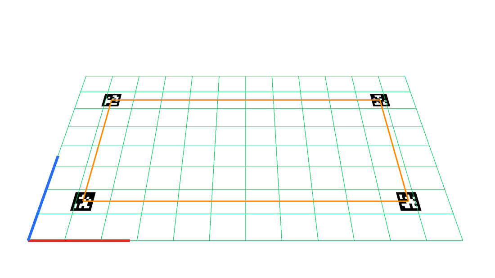
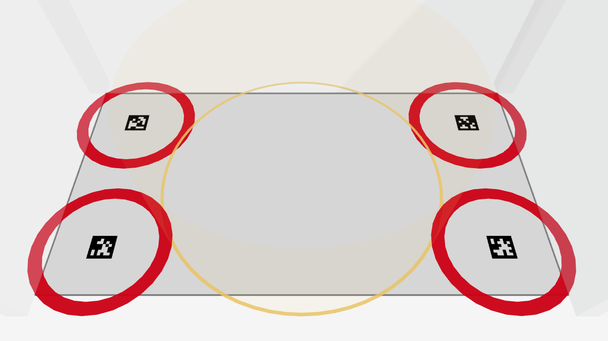
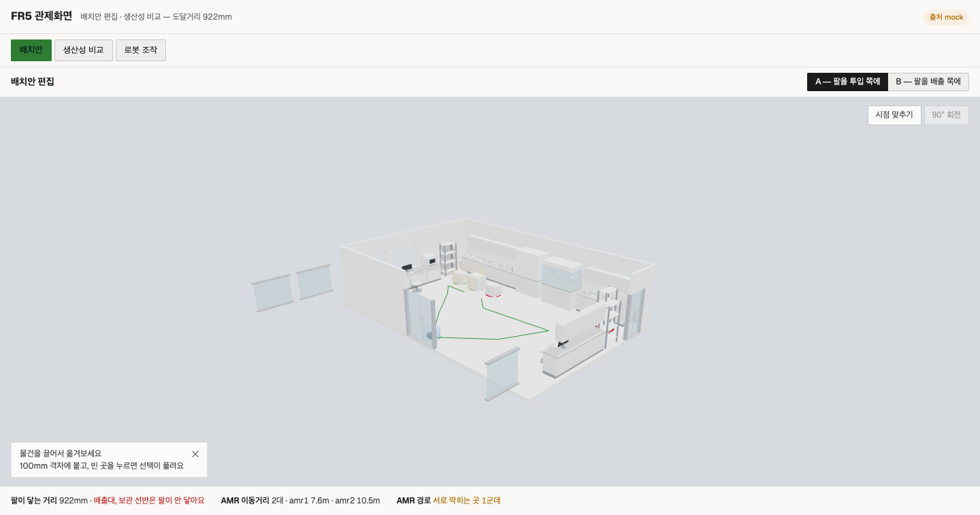

# 글로벌 카메라 오버레이 — 수학·사슬 검증 (하드웨어 0)

날짜: 2026-08-02 · 분류: 증거 · 게이트: `scripts/map/check-camera.sh` · `scripts/map/check-overlay.sh`

인쇄물도 웹캠도 없이 **합성 사진**으로 카메라 정합의 전부를 판정했다.
실기에서 처음 만났으면 원인이 카메라인지 좌표계인지 캘리브레이션인지 못 갈랐을 것들이다.

## S1 — OpenCV 카메라 → three.js 카메라 (수학만)

같은 3D 점을 `cv2.projectPoints` 와 three.js 카메라로 각각 투영해 픽셀 대조.

| 조건 | 결과 |
|---|---|
| 주점이 화면 중앙에서 (7, 26)px 어긋남 | `PerspectiveCamera(fov)` 로는 표현 불가 → 투영 행렬 직접 구성 |
| 바닥 위·바닥 밖 높이 포함 7 점 | **최대 오차 0.000 px** |

**여기서 D43(거울 좌표계)을 찾았다.** `planToScene` 이 `[x, z, y]` 였는데 행렬식이 −1 인
거울 사상이라 씬이 실제의 좌우 반전이었다. 변환 모듈이 행렬식을 검사해 즉시 던졌고,
`[x, z, -y]` 로 고친 뒤 0.000px 가 됐다. 카메라로는 흡수 불가 — 상세는 `DECISION-LOG` D43.

## S3 — 사진 한 장에서 시작하는 전체 사슬

합성 사진 → cv2 태그 검출 → solvePnP → `global-cam.json` → three.js 카메라 → 픽셀.
**참값을 안 쓰고 이미지에서만 푼다.** 태그는 z=0 바닥에만 둔다(높이 오차 분리).

| 항목 | 결과 |
|---|---|
| 태그 검출 | 4/4 |
| 사진에서 푼 카메라 위치 | 참값 대비 **3.8 mm** (2.4m 거리에서 0.16%) |
| 태그 모서리 16 점 (정답 = 검출 픽셀) | 최대 **1.80 px** — 검출·리샘플 잡음 |
| 바닥 격자 교점 15 점 | 최대 **0.000 px** |

주황 = 실험실 좌표로만 그린 태그 중심 연결선. 사진 속 태그 네 장의 **정중앙을 지난다.**
초록 = 바닥 격자(250×200mm). 빨강 = +X, 파랑 = +Y (원점은 좌하단).

## S4 — WebGL 실렌더 (`AR/cam.html`)

합성 사진을 `` 로 깔고 `createStage(host, { alpha, controls:false, calib })` 위에
`layout-view` 를 그대로 얹었다. 헤드리스 CDP 로 띄워 판정했다.

| 항목 | 결과 |
|---|---|
| OrbitControls | `null` — 실카메라는 돌지 않는다 |
| `scene.background` | `null` + clearAlpha 0 — 영상이 비친다 |
| three.js 카메라 위치 | 씬 (1.498, 2.398, 0.802) = `planToScene([1498, -802, 2398])` |
| **렌더된 화면에서 잰 정합** | 스테이션 링 4개 ↔ 사진 속 태그 중심 **최대 0.83px** (캘리브 해상도 환산) |

빨강 링 = 실험실 좌표 (300,300)·(2700,300)·(2700,1300)·(300,1300) 에 놓은 스테이션.
**사진 속 태그 정중앙에 얹힌다.** 노랑 = FR5 도달 범위 922mm. 반투명 회색 = 벽(높이 2m).

측정 방법: 렌더된 스크린샷에서 태그를 **다시 검출**해 중심을 얻고, 같은 실험실 좌표를
캘리브레이션으로 투영한 값과 비교했다. 눈대중이 아니다.

### 거울 수정 (D43) — 여기서 실제로 걷혔다

`layout-view.js` 12곳 · `props/index.js` 1곳 · `interaction.js` 4곳(되돌리기 포함)을
`planToScene` 규약으로 맞췄다. yaw 부호도 같이 뒤집힌다(평면도 θ → `rotation.y = +θ`).
게이트 `scripts/check/scene-axes.sh` 가 씬 좌표를 `planToScene` 과 대조해 재발을 막는다.

## 대시보드 재확인 — 축을 고쳤으니 원래 화면도 봤다

`layout-view.js` 를 17곳 고쳤으므로 배치안 화면이 깨지지 않았는지 헤드리스로 다시 띄웠다.

| 항목 | 결과 |
|---|---|
| 콘솔 에러 | 0 |
| 캔버스 | 1440×572 렌더됨 |
| 문 2개(south·east) | **벽면 좌표와 일치** — 문틀·문짝·문턱이 벽 평면 위에 있다 |

**발견 — 컷어웨이가 벽만 숨긴다.** 숨긴 벽의 유리문이 허공에 뜬다(그림 좌우의 파란 판).
`updateCutaway` 가 `wallMeshes` 만 토글하고 문 부품은 안 건드리기 때문이다.
**이번 수정 때문이 아니라 기존 동작**이다 — 문이 벽면 위에 있다는 것을 좌표로 확인했다.
GAP-MATRIX 에 OPEN 으로 올렸다.

## 아직 아닌 것

- **렌즈 왜곡이 0 인 합성이다.** three.js 는 핀홀만 그리므로 실제 렌즈에서는 **영상 쪽을
  반드시 언디스토트**해야 한다. 무시하면 모서리 오차가 이만큼이다 (1920×1080·fx 1371 기준):

  | k1 | 화면 중앙 | 화면 모서리 |
  |---|---|---|
  | −0.05 (약한 배럴) | 0.0px | **42px** |
  | −0.10 | 0.0px | **97px** |
  | −0.25 (광각) | 0.0px | **694px** |

  → 광각 렌즈를 피하라는 권고가 여기서 숫자가 된다. 중앙만 보고 "맞는다"고 판단하면 안 된다.
- **높이는 사진으로 검증되지 않았다.** 바닥 밖 점의 투영은 cv2 와 0.000px 로 맞췄지만(S1),
  사진 속에 높이 있는 실물이 없어 사진 대조는 바닥 평면까지다. 실제 맵에서 벽을 세우면 닫힌다.
- **라이브 영상이 아니다.** `#feed` 의 src 를 MJPEG 로 바꾸는 것이 남았다 (G4) —
  카메라 스트림을 어느 브리지가 소유할지 미결이라 계약이 먼저다 (하드 룰 1).
- **영상 지연 보정이 없다.** 정지 사진이라 지금은 드러나지 않는다. 라이브에서 필수.
