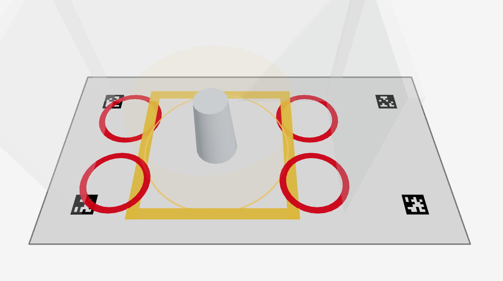

# 글로벌 카메라 — 갤럭시를 카메라로 붙이고, 수동 초점이 거짓말인 것을 잡았다 (2026-08-04)

분류: 증거 · 게이트: `scripts/map/cam-lock.sh` · 대상: Galaxy S24+ (SM-S926N) · IP Webcam

**하드웨어 블로커가 풀렸다.** 640×480 USB 웹캠 대신 갤럭시가 2560×1440 을 준다.
그리고 하루의 대부분을 잡아먹은 "검출 0" 의 범인은 인쇄물도 높이도 아니라
**이 폰의 수동 초점이 실제 렌즈를 안 움직인다는 것**이었다.

## 붙이는 경로

| | 값 |
|---|---|
| 앱 | IP Webcam (`com.pas.webcam`) — MJPEG + HTTP 설정 API |
| 유선 | `adb forward tcp:8080 tcp:8080` → `http://localhost:8080/video` |
| 무선 | `http://<폰IP>:8080/video` — 같은 값이 그대로 돈다 |
| 처리량 | 유선 57.4 fps · 무선 56.8 fps (1080p · 90프레임 · 실패 0) |

**무선이 유선과 같다.** 케이블 길이가 설치를 제한하지 않는다.
유선의 남는 이점은 충전 동시(발열 시 폰이 스스로 화질·프레임을 깎는다)와
캠퍼스 망 정책 무관 둘이다. `localhost` 는 보안 출처라 https 배포본에서도
혼합 콘텐츠로 안 막히지만, 무선(`192.168.x.x`)은 막히므로 로컬 dev 로 열어야 한다.

## 범인 — `focusmode=off` + `focus_distance` 는 **되읽어도 참이 아니다**

| 상태 | 되읽은 `focus_distance` | 선명도 | ChArUco 코너 |
|---|---|---|---|
| 자동초점이 맞춘 직후 | 0.30 | **954** | **35/35** |
| 거기서 `focusmode=off` 로 "고정" | 0.30 (같다) | **36** | **0/35** |

**숫자는 요청한 대로 돌아오는데 렌즈는 거기 없다.** 되읽기 확인이라는 원칙은 맞았지만
확인한 대상이 기기가 말하는 값이었다 — 그건 검증이 아니라 메아리였다.
이 하나 때문에 보드 크기·카메라 높이·인쇄 품질을 차례로 의심하며 판을 여러 번 버렸다.

**고친 절차** — 자동초점을 **측정 도구로 한 번만** 쓴다.

```
focusmode=auto  →  /focus 트리거  →  약 8초 수렴  →  그대로 둔다
```

`/nofocus` 를 걸어도 950대를 유지했다. 고정 카메라는 장면이 안 변하니 다시 헤매지 않는다.
**판정은 되읽은 다이옵터가 아니라 실제 프레임의 라플라시안 분산 수렴**으로 한다
(`cam-lock.sh` 가 `397 → 394 → 394 → 395` 처럼 찍는다).

## 해상도 — 1440p 가 최적점

같은 A4 ChArUco(6×8 · 28mm) · 같은 자리 · 초점 맞춘 상태:

| 해상도 | fps | 코너 | 마커 |
|---|---|---|---|
| 1920×1080 | 48.6 | 28/35 | 21 |
| **2560×1440** | **35.3** | **35/35** | **24** |
| 3840×2160 | 12.3 | 35/35 | 24 |

4K 는 검출이 같은데 fps 만 3분의 1이다. **A3 재인쇄는 필요 없다** — 검토했다가 접었다.

부수 실측 — 마커가 20px 아래로 내려가면 확대해도 안 살아난다(4배 확대에 24장 중 6장).
36h11 해독에는 **마커 한 변 32~40px** 이 필요하다. 대비(명도차 129)나 검출 파라미터
문제가 아니라 정보량 문제다 — CLAHE·정규화 스트레치 모두 0장이었다.

## `cam-lock.sh` — 찍기 전 매번 돌린다

해상도·화질·화이트밸런스·줌·초점을 잠그고 **되읽어 확인**한다.
실측으로 잡아낸 것들:

- 세션 도중 IP Webcam 이 재시작해 `quality 90→49` · `focusmode→continuous-video` ·
  `whitebalance→auto` 가 **조용히 되돌아가 있었다.** 화면에는 아무 표시가 없다
- 케이블을 다시 꽂으면 `adb forward` 가 사라진다 → localhost 경로면 자동으로 다시 건다
- 먼 초점은 다이옵터 0.1 눈금이라 3400mm 요청이 5000mm 로 잘린다 (게이트가 FAIL 로 잡음)
- 같은 값을 다시 넣으면 카메라가 재시작하므로 **다른 것만** 바꾼다
- 해상도를 바꾼 직후 `status.json` 은 **키가 빠진 채** 돌아온다 → 돌아올 때까지 기다린다

## 겹치기 화면이 **대시보드 배치안**을 받는다 (`AR/cam.html`)

전에는 `cam.js` 안에 배치안이 하드코딩돼 있었다 — 고정물 전용 화면이었다.
셋을 밖에서 받게 바꿨다. **전부 URL 로 넘어가 링크 하나로 재현된다.**

| 파라미터 | 무엇 |
|---|---|
| `?feed=<MJPEG URL>` | 카메라 영상. 없으면 합성 고정물 |
| `?scene=<JSON URL>` | 대시보드 **내보내기** 산출물 그대로. 파일 선택·`localStorage` 도 된다 |
| `?fit=WxD&anchor=x,y` | 태그 사각형(mm)에 맵을 **맞춰 줄인다** |

**배율이 필요한 이유** — 배치안은 12m 방인데 강의실은 3m 다. 1:1 로 겹치면 벽이 방을
뚫고 나간다. 태그를 놓은 사각형에 맵을 넣으면 **태그 배치가 곧 맵 크기**가 된다.
`min(W/floorW, D/floorD)` 로 **균일 스케일만** 쓴다 — 가로·세로를 따로 맞추면 로봇이
찌그러지고, 그 화면으로 도달 범위를 판단하면 틀린 판단을 한다.

**배율을 화면에 늘 적는다** (`1:2.5 축소 — 실물 크기 아님`). 줄어든 것은 도달 범위 링도
마찬가지인데, 표시가 없으면 "저 링 안이면 안전하다"로 읽힌다.

캘리브레이션 파일은 `import.meta.glob` 으로 읽는다. `intrinsics.py` 의 산출물이라
**캘리브레이션 전에는 정상적으로 없고**, 정적 import(D18)로 두면 그때까지 빌드가 깨진다.
없으면 고정물로 떨어지고 **화면이 노란 글씨로 "합성 고정물"이라고 말한다.**



### 판정 — `node scripts/check/cam-web-verify.mjs` · **12/12**

눈으로 보지 않는다. 합성 사진에서 태그를 **cv2 로 다시 검출**해 얻은 중심과, 화면이
실제로 쓰는 카메라로 실험실 좌표를 투영한 픽셀을 대조한다.

| | 결과 |
|---|---|
| **정합 (스테이션 좌표 ↔ 사진 속 태그 중심)** | **최대 0.80px** — S4 실측 0.83px 재현 |
| 배치안이 파일에서 올라온다 | 하드코딩 제거 확인 |
| fit 배율 · 균일성 · 앵커 | 3000×1600 → `fit=1200x800` = **0.40** · x=y=z · `planToScene` 규약대로 |
| 슬래브 숨김 · 배경 투명 · 캔버스 | 영상이 비친다 |
| 합성 고정물 경고 | 노란 상태 표시 |

고정물의 배치안도 이제 `make-fixture.py` 가 사진과 **같이** 낸다 — 태그 자리를 화면 쪽에
다시 적으면 사진과 배치안이 조용히 어긋나고, 그러면 겹침이 틀린 건지 코드가 틀린 건지 못 가른다.

## 확인하지 않은 것

- **`intrinsics.py` 를 아직 안 돌렸다.** 코너 35/35 는 한 장 기준이고, 15~20장의
  재투영 RMS(≤0.5px)는 미측정이다. 자동초점이라 **장마다 렌즈 상태가 다를 위험**이 남는다 —
  보드 거리를 크게 바꾸지 말고 각도·화면 위치 위주로 찍어야 한다. 이 위험은 게이트가 잡는다
- **화각을 안 쟀다.** 검출 코너 간격으로 역산한 수평 44° 는 추정이고, 1080p 와 1440p 의
  화각이 같은지도 미확인이다. 다르면 해상도를 바꿀 때 내부 파라미터를 그냥 스케일할 수 없다
- **카메라 높이·설치 거리 미측정.** 줄자가 없었다. `extrinsics.py` 의 출력이지 입력이 아니라
  진행에는 지장이 없다
- **태그(AprilTag) 실기 검출은 아직 안 했다.** ChArUco 픽셀 대응에서 환산하면
  1440p 에서 약 17 px/칸(안전선 5.0)이지만 **환산이지 실측이 아니다**
- 렌즈 왜곡 · 라이브 MJPEG 겹치기 · 지연 보정 — 전부 그대로 열려 있다
- **겹치기 화면을 실측 캘리브레이션으로 돌린 적이 없다.** 12/12 는 전부 합성 고정물이다.
  `?feed=` 로 라이브 MJPEG 을 꽂아 본 적도 없다 (스트림 주인 계약이 먼저다 — 하드 룰 1)
