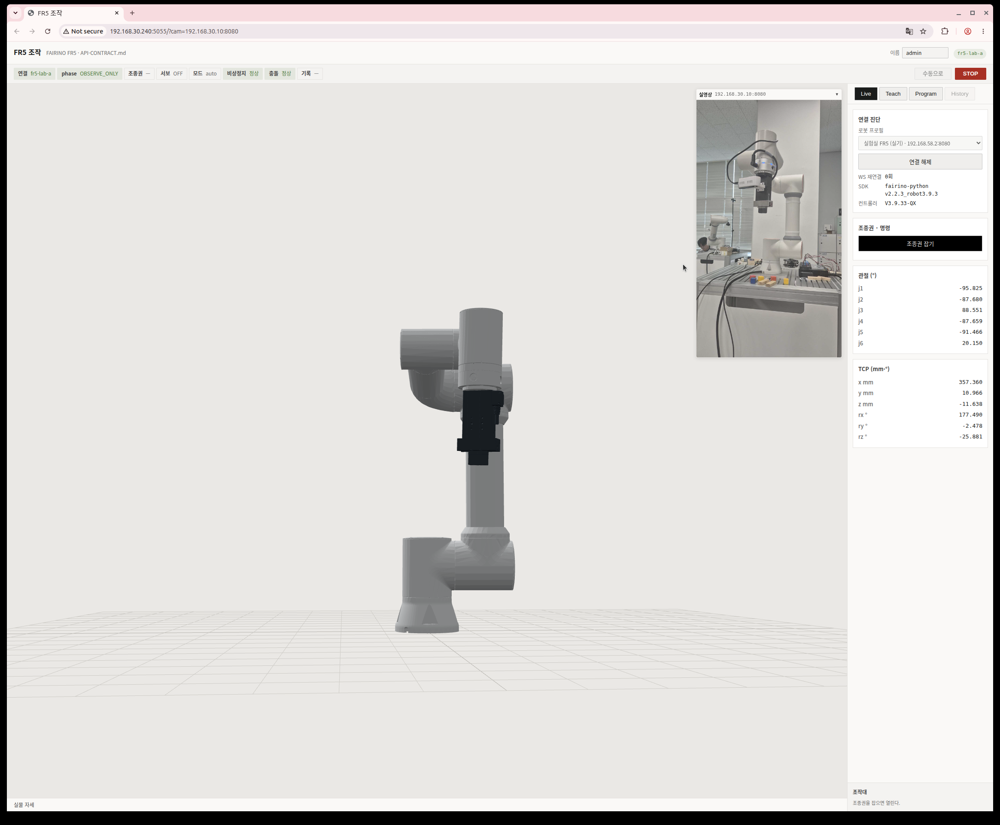

# FR5 조작 화면에 글로벌 카메라 실영상 (PiP) — 실렌더 12/12 + 우분투 실기

분류: 증거 · 2026-08-06 · 검증 `node scripts/check/fr5-cam-verify.mjs` (폰이 켜져 있어야 한다)

3D 쌍둥이 **우상단에 접히는 작은 실영상 창**을 달았다. 실물과 3D 를 한 화면에서 대조한다.
`fr5-cam-pip.png` 이 실제 폰(`192.168.30.10:8080`) 프레임이 뜬 화면이다.

## 왜 겹치지 않고 나란히 두나

**겹치려면 `labToCam`(카메라 외부 파라미터)이 있어야 하는데 없다.**
`Shared/data/config/global-cam.json` 에는 내부 파라미터만 있다 (2560×1440 · RMS 0.4107px ·
사진 20장). `scripts/map/extrinsics.py` 를 아직 안 돌렸다 — `check-calib.sh` 도 그렇게 말한다
("labToCam 아직 없음 — 카메라 설치 후"). PiP 는 정합이 필요 없어 **그 전에 된다.**

겹치기(`ar-global-camera.md` §G2)는 `labToCam` 이 생긴 뒤 같은 `.stage` 칸 안에서 승격한다.

## 배치 판정 — `AR/` 도 `planning/` 도 아니다

| | 왜 |
|---|---|
| `FR5/src/features/live/CamView.jsx` | 읽기 전용 표시다. 명령을 안 보낸다 |
| **탭 밖** (`main.jsx` `.stage` 안) | 패널 안에 두면 탭을 옮길 때마다 재마운트돼 **MJPEG 연결이 끊겼다 다시 붙는다.** 3D 를 탭 밖에 둔 것과 같은 이유다 |
| 우상단 절대배치 | 3D 크기를 안 줄이는 것이 이 안의 요점이다. 아래는 `.twinnote` 가 쓰고 궤도 조작은 가운데서 일어난다 |
| **브리지 중계 안 함** | 브라우저가 폰을 직접 본다 → 계약·라우트·`vite.config.js` §API_PATHS 세 곳이 안 는다 |

주소는 `datasource.cameraFeedUrl()` 이 준다 — 화면은 주소를 모른다 (`FR5/AGENTS.md`).

## 주소를 빌드에 안 박는 이유 (실측)

**폰 IP 가 바뀐다.** 이날 USB(`adb forward localhost:8080`)로 붙어 있던 같은 폰이 WiFi 로
옮겨가며 `192.168.30.10` 을 새로 받았다. LAN 전수 스캔으로 찾았다.
→ `?cam=<host>` 로 한 번 주면 `localStorage` 가 기억하고, `?cam=` (빈 값) 이면 잊는다.
`AR/src/screens/cam.js` 의 `?scene=` 과 같은 규약이다.

## 실렌더가 잡은 결함 하나 — "여는 중…" 에서 안 넘어갔다

없는 IP(`192.168.30.199`)를 주면 **`onError` 가 20초 안에 안 온다.** TCP 연결이 OS
타임아웃까지 매달리는 동안 화면은 계속 "여는 중…" 이었다. 오래된 주소가 저장돼 있으면
사람이 그걸 "곧 뜨겠지" 로 읽는다 — **결측을 정상으로 읽는 그 모양**이다.

→ 첫 프레임 마감시각 `FIRST_FRAME_MS = 8000` 을 뒀다. 넘으면 **"영상 없음" + 다시 시도**.
반복 확인이 아니라 한 번 재고 끝내는 타이머다.

**주소가 아예 없는 것과는 다르게 다룬다** — 그건 "기능을 안 켠 것"이라 창을 안 띄운다.
주소가 있는데 영상이 안 오는 것만 경고색으로 말한다.

## 판정

| | |
|---|---|
| 신규 실렌더 | **12/12 PASS** (`fr5-cam-verify.mjs`) |
| 기존 회귀 | **52/52 PASS** (`fr5-web-verify.mjs`) — 3D·조종권·티치 전부 그대로 |
| 게이트 | `bash scripts/check/all.sh` 전체 통과 |
| 최초 실측값 | 스트림 `naturalSize` **2560×1440** · 작은 PiP 가 3D 면적의 **5.8%** |

## 08-06 우분투 실기 재검증 — 프록시·회전·크기

시크릿 창에서도 영상이 안 뜬 원인은 캐시가 아니었다. 우분투 GNOME 프록시가 켜져 있었고
예외가 loopback 뿐이라 LAN 의 폰 MJPEG 요청도 프록시로 보냈다. 아래처럼 **두 호스트만**
예외에 추가했다. 같은 WiFi 전체를 우회시키는 CIDR 예외는 쓰지 않았다.

```text
['localhost', '127.0.0.0/8', '::1', '192.168.30.10', '192.168.30.240']
```

Chrome 을 완전히 다시 연 뒤 `192.168.30.240 → 192.168.30.10:8080` TCP 연결과 실제 프레임을
확인했다. 현재 폰 앱이 낸 프레임은 **1920×1080**이다. 위 2560×1440은 최초 실측이며,
캘리브레이션용 설정이 아직 그대로라는 뜻은 아니다.

폰 원본은 바닥이 화면 오른쪽에 있는 16:9 가로 프레임이었다. CSS에서 시계 방향 90° 돌려
사람·로봇·바닥이 바로 서게 했고, PiP는 **9:16 · 340px**로 배포했다. 이전 170px에서 가로와
세로를 각각 2배로 키운 것이므로 면적은 4배다. 좁은 화면은 기존 132px 규칙을 유지한다.



실기 화면에서 `phase OBSERVE_ONLY`, 조종권 없음, 서보 OFF를 함께 확인했다. 카메라 배치 변경은
읽기 전용 CSS뿐이며 로봇 명령 경로를 건드리지 않는다.

## 경량 감사 9문답

| # | 질문 | 답 |
|---|---|---|
| 1 | 목적은? | 실물과 3D 자세를 같은 화면에서 똑바로, 충분히 크게 대조한다. |
| 2 | 범위는? | 데스크톱 PiP의 크기·비율·표시 회전과 우분투 프록시 예외뿐이다. |
| 3 | 가장 큰 실패는? | 3D를 과하게 가리거나 원본을 잘못된 방향으로 한 번 더 돌리는 것이다. |
| 4 | 다른 방법은? | 폰 설정 회전, 브리지 중계·변환, CSS 표시 회전 세 가지를 비교했다. |
| 5 | 왜 CSS인가? | 기존 `` 한 곳만 바꾸며 캡처·캘리브레이션·API 계약을 건드리지 않는다. |
| 6 | 단점은? | 340px 창이 3D 우상단을 더 가린다. 접기 버튼과 모바일 132px가 탈출구다. |
| 7 | 경계는? | 760px 이하에서는 132px, 주소 없음은 숨김, 첫 프레임 실패는 재시도를 유지한다. |
| 8 | 롤백은? | `.camview` 너비와 `.cambody` 비율·`img` 변환만 이전 값으로 되돌린다. |
| 9 | 검증은? | 프로덕션 빌드·우분투 배포·실 TCP·실영상 스크린샷·전체 게이트로 확인한다. |

## 남은 것

- **겹치기는 `extrinsics.py` 뒤다.** 그게 이 화면의 다음 칸이다
- 스트림 도중 폰이 사라지는 경우는 안 다뤘다 — 첫 프레임만 본다. 필요해지면 그때 넣는다
- MJPEG 는 `` 하나가 폰과 연결을 붙들고 있다. 팀원 n 명이 열면 스트림 n 개다
  (IP Webcam 이 `video_connections` 로 센다). 상한은 아직 필요 없다
