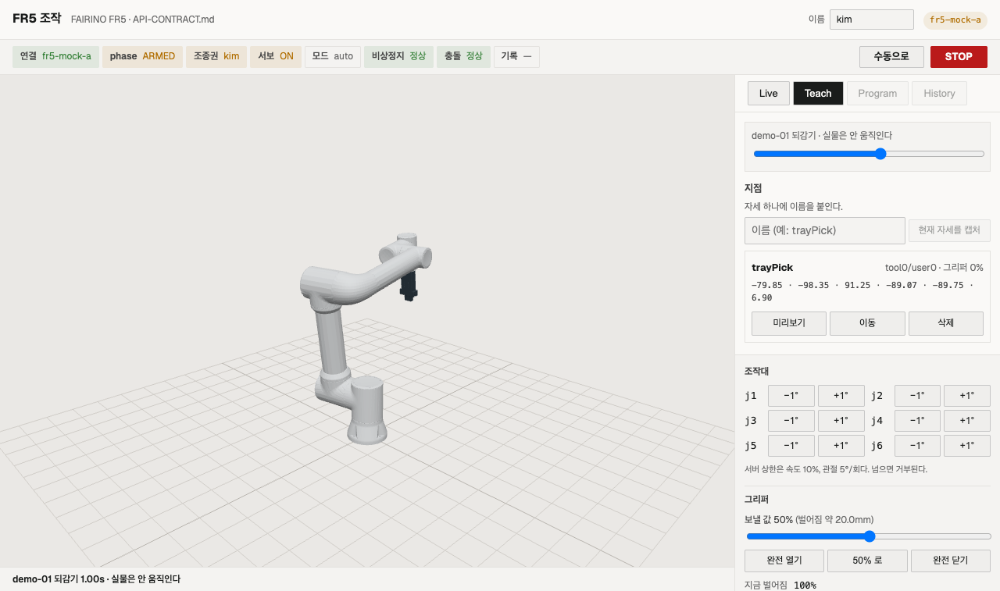
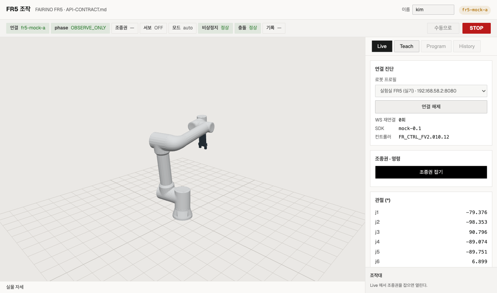

# 조작대를 Live 에서 꺼냈다 — 계획서가 2026-08-03 에 이미 정해 둔 자리로

**주인님이 실기에서 지적했다.** "티치모드에서 그리퍼를 조작하려면 라이브를 왔다갔다 해야 한다."

찾아보니 **새로 설계할 것이 아니었다.** `FR5-IMPLEMENTATION-PLAN.md` §레이아웃(2026-08-03 확정)이
그림까지 그려 놓고 이유까지 적어 뒀다:

> **왜 이렇게 하나** — Teach 는 로봇을 조그하며 쓰는 화면이다. 탭이 전체를 갈아치우면
> "자세를 만든다 → 캡처한다" 사이에 화면이 두 번 바뀌고, 돌아올 때마다 목록 상태가 리셋된다.
> - 조그·그리퍼 조작대는 오른쪽 아래에 **상시** 둔다. Live 패널의 소유물이 아니다

구현이 그걸 안 따라가 `LivePanel.jsx` 안에 조그·그리퍼가 들어 있었다. **계약 미준수지 설계 공백이 아니다.**

그리퍼가 특히 아팠던 이유는 계약에 있다 — 캡처가 굳히는 값에 `gripperPct` 가 들어간다
(`API-CONTRACT.md` §이동 지점). 파지 자세 하나를 가르치려면 **캡처 전에** 그리퍼를 맞춰야 하는데,
그 조작기가 다른 탭에 있었다. 왕복이 취향 문제가 아니라 작업 순서에 박혀 있었다.

## 고친 것

| | 전 | 후 |
|---|---|---|
| 조그·그리퍼 | `LivePanel` 내부 | `features/control/ControlDock.jsx` · `main.jsx` 가 상시 렌더 |
| 3D 쌍둥이 | Live·Teach 가 **각각** `RobotTwin` 마운트 | 인스턴스 **하나**, `main.jsx` 소유 |
| 미리보기·되감기 자세 | 패널이 직접 그림 | 패널이 `onView` 로 올려보내고 `main.jsx` 가 그림 |
| 탭이 바꾸는 것 | `<main>` 전체 | `.panelbox` 만 |

쌍둥이를 하나로 합친 것은 덤이 아니라 같은 문장의 나머지 절반이다 — 패널마다 마운트하면
탭을 옮길 때마다 재생성돼 카메라 각도가 리셋된다(계획 §레이아웃 "3D 카메라 각도·선택 상태가 유지된다").

## 실렌더 판정 — `node scripts/check/fr5-web-verify.mjs` **49/49 PASS**

새로 넣은 검사 3건:

```
PASS  Teach 에서도 조그·그리퍼 조작대가 그대로다 (Live 왕복 없음)
PASS  3D 쌍둥이는 탭을 옮겨도 한 인스턴스다 (카메라 각도 유지)
PASS  Teach 를 떠나지 않고 그리퍼가 움직인다 — 탭 이동 0회
```

마지막 것이 이 변경의 완료 판정이다. Teach 탭에 선 채로 `완전 열기` 를 눌러
`gripper-raw` 가 `100%` 로 돌아오는 것을 확인했다 — `fr5-teach-dock.png` 우하단에 그 숫자가 찍혀 있다.




## 실렌더가 잡아낸 것 — 표가 뭉갰다

오른쪽 열을 조작대와 나눠 쓰면서 폭이 340px 이 되자 **지점 5열 표가 깨졌다.** 첫 스크린샷에서
"그리퍼" 헤더가 세로로 한 글자씩 쪼개지고 행이 관절값 하나만 남았다. 눈으로 안 봤으면 통과했을 것이다
(검사는 `data-name` 만 보므로 전부 PASS 였다).

- **표 → 카드.** 관절 6개는 어차피 340px 한 줄에 안 들어간다. 이름을 크게, 관절값은 mono 로 줄바꿈,
  버튼 3개는 같은 폭으로 아래에 깐다 (세로 29px → 33px, 손가락이 닿는다)
- **조그 6축을 2열로.** 한 열로 세우니 조작대가 40dvh 를 넘겨 지점 카드 버튼이 잘렸다.
  `jogrow` 순서는 j1..j6 그대로라 첫 행이 여전히 j1 이다 (검사가 인덱스 0 을 누른다)

## 같이 한 것 — UI 카피에서 `—` 동격 구문을 걷었다

`ARM — 서보 ON` · `활성화 — 손가락이 움직인다` · `지점 — 자세 하나에 이름을 붙인다` 처럼
**한 화면에서 같은 리듬이 열 번 반복**되고 있었다. 실측 **31줄 → 0줄**.
(남은 12줄은 개발자 주석 8 + 값 없음 표시 `'—'` 4 다. 둘 다 사람이 읽는 문장이 아니다.)

문체는 프로젝트 목소리인 `~한다` 평서체를 그대로 뒀다. 바꾼 것은 **리듬**이지 말투가 아니다.
검증이 문자열로 붙잡는 문구(`아직 안 보냈다` · `되감기` · `N / M`)는 그대로 보존했다.

## 이어서 — 감사 P0 셋을 닫았다 (같은 날)

`evidence/2026-08-05/audit-harness-and-bridge.md` 가 "등재만 한다" 로 남겨 둔 넷 중 셋.
**최종 52/52 PASS · `all.sh` 전체 통과 · 브리지 단위 121건.**

**P0-2 궤적 이름이 그대로 파일 경로** — `teach.py` 에 `safe_name` 신설
(`^[A-Za-z0-9가-힣_-]{1,64}$`). 세 가지를 같이 정했다:

- **거르고 자르지 않는다.** 잘라 주면 두 이름이 한 파일이 되어 조용히 덮어쓴다
- **녹화 시작에서 막는다.** 저장에서 막으면 120초를 녹화하고 버리게 된다
- **`_path()` 가 `resolve()` 로 한 번 더 본다.** 호출처가 검사를 빠뜨려도 파일이 안 새어 나가는
  마지막 방어선이다. `save` 는 폴더 밖이면 `ValueError` 를 던진다

**P0-3 `NaN` 이 안전 설정 대조를 통과** — `session._within` 신설. `math.isfinite` 를 결측과
같이 취급한다. **감사가 안 짚은 같은 뿌리를 하나 더 찾았다** — `cogMm` 비교의 `zip` 은 짧은 쪽에서
조용히 멈춰서, 되읽기가 빈 목록이면 **비교가 0회 도는데 통과**였다. 길이도 같이 본다.

**P0-4 지점 삭제에 확인이 없다** — 카드 안 2단계(`삭제` → `취소`/`지운다`).
**`window.confirm` 은 쓰지 않았다** — 브라우저 모달은 화면 전체를 막아 실렌더 검증과 자동화가
그 자리에서 멈춘다. 확인을 그 카드 안에서 하면 검사가 그대로 통과하고, 사람도 맥락을 안 잃는다.

회귀 검사는 "고쳤다" 가 아니라 **"한 번에 안 지워진다"** 를 본다 — 확인 단계가 사라지면 깨진다.

```
PASS  경로가 되는 궤적 이름은 거부된다 (임의 파일 덮어쓰기 차단)
PASS  삭제는 한 번 더 묻는다 (되돌리기가 없다)
PASS  취소하면 지점이 그대로 남는다
```

## 남긴 것

- **P0-1(게이트가 `.mjs` 를 안 집는다)은 감사가 아는 것보다 크다.** `.mjs` 9개 중 **6개가
  절대경로로 import** 하고, `fr5-web-verify` 의 `OUT` 기본값은 **끝난 세션의 스크래치패드**를
  가리키는데 `screenshot` 은 `writeFileSync` 뿐이라 폴더를 안 만든다. `tb-real-verify` 는
  실물이 필요해 게이트 대상이 아니다. 그리고 감사의 "관제 17/28" 이 맞다면 **집는 순간
  `all.sh` 가 빨개진다** — 팀 게이트를 빨갛게 두는 결정은 사람이 한다
- **폰 보기 전용이 아직 미구현이다** (계획 §폰 · 안전 규약). `matchMedia`·`coarse` 게이트가 0건이라
  폰에서도 조그·그리퍼·캡처가 렌더된다. 조작대를 상시로 만들면서 **노출이 늘지는 않았다** —
  조종권 + ARMED 일 때만 그리므로 조건은 전과 같다. 그래도 "구조적으로 없앤다" 는 아직 아니다
- 지점 이름에는 상한이 없다 (감사 P2). 파일명이 안 되므로 경로 문제는 없지만 길이는 안 막혀 있다
