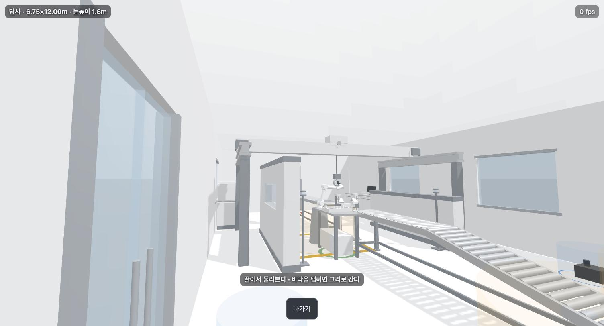
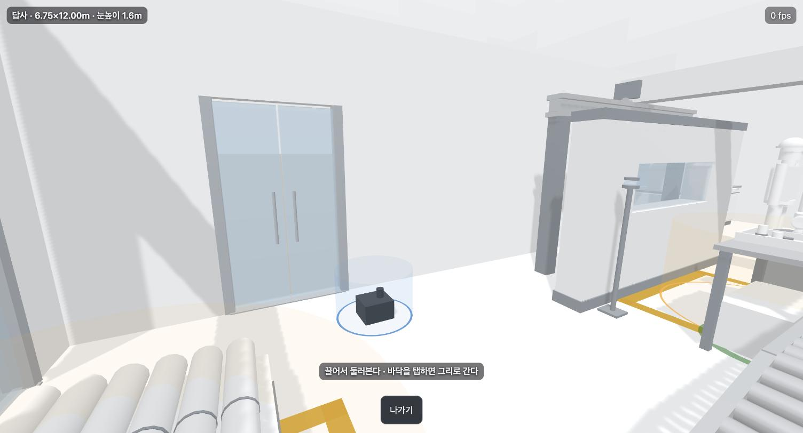

# XR 이 바닥에 안 붙는 원인 셋 + 답사 모드 (2026-08-06)

`xr.html` 이 "처음 화면에 따라 공중에 떠 보인다" 를 원인별로 갈라 고치고, **주변이 공장처럼
보이는** 요구를 AR 이 아니라 별도 모드로 받았다.

## 뜬 원인은 캘리브레이션이 아니었다

두 모서리 탭(D67)은 **축척·회전**을 잡는 장치다. 높이와 드리프트는 다른 셋이 만들고 있었다.

| 원인 | 무엇이 빠져 있었나 | 고침 |
|---|---|---|
| **드리프트** | `XRAnchor` 미사용. 놓은 자리가 `local-floor` 의 고정 숫자로 남는데 ARCore 는 세션 내내 바닥 추정을 갱신한다 — 좌표계가 움직이고 배치안만 옛 자리에 남는다 | `optionalFeatures:['anchors']` → `frame.createAnchor()` → 매 프레임 `getPose(anchorSpace)` 로 위치 갱신. yaw 는 사람이 정한 값을 유지 |
| **접지 단서 0** | `shadowMap` 꺼짐 + 슬래브 숨김 = 그림자를 던질 광원도 받을 면도 없었다. `layout-view.js` 의 메시는 이미 `castShadow=true` 였는데 아무 데도 안 떨어졌다 | `shadowMap.enabled` + 키 라이트를 앵커 밑에 두고 배율 따라 그림자 상자 갱신 + 슬래브 자리에 `ShadowMaterial` 그림자 받이 |
| **바닥 높이** | 한 프레임 hit 결과 중 최저 = *그 광선 위*의 최저일 뿐. 책상을 겨냥한 채 탭하면 책상 높이에 앉는다 | 세션 전체 최저 y 를 `floorY` 로 기억해 놓을 때 강제. 로그에 `겨냥 높이` / `바닥` 을 둘 다 적어 차이가 보이게 |
| (덤) 워밍업 | 첫 평면 추정이 가장 거친데 바로 놓게 뒀다 | 평면 발견 후 `WARMUP_MS=1500` 은 탭을 안 받고 "바닥을 조금 더 훑어라" |

**대시보드에는 이미 있었다.** `stage.js:40` 이 그림자를 켜면서 주석까지 달아 뒀다 —
*"접지감. 없으면 물체가 떠 보인다"*. AR 에서만 빠져 있었다.

## 답사 모드 — 주변을 가리는 건 AR 이 못 한다

"주변이 방산공장처럼 보이게" 는 **패스스루로는 원리상 불가**다. 실제 방이 그대로 보인다.
그런데 `layout-view.js` 는 이미 벽(두께 120mm)·천장고 2700·문·유리창을 그리고 있었다 —
겹치기가 **슬래브와 벽을 안 쓰는** 것뿐이었다. 그래서 새 에셋도 새 계약도 없이 모드 하나를 더 뒀다.

`immersive-vr` 은 안 쓴다 — 안드로이드 크롬은 헤드셋 없이 안 열어준다. 대신 **XR 세션 없는
1인칭 렌더**다. 부수 효과가 크다: **PC 브라우저에서 열려서 이 화면이 처음으로 실렌더 검증된다.**

조작은 둘뿐이다 — 끌면 둘러보고, **끌지 않은 탭은 그 바닥으로 간다**(방 안으로 클램프).
조이스틱을 안 만든 이유는 이 모드의 용도가 "배치를 눈으로 확인" 이지 이동이 아니어서다.

## 확인한 것 (localhost `vite preview`, Chrome)

- `cell` 프리셋 6.75×12.00m · **팔 2대 · 애니메이션 켬** 으로 답사 진입 — `팔 1/2 준비 128,584 삼각형`
- **팔이 서 있다** (`walk-inside.jpg`). 축 계산만 맞춰 놓고 눈으로 못 봤던 항목이 이 모드로 닫혔다
- **그림자가 바닥에 떨어진다** — 갠트리 기둥·문틀·작업대 (`walk-shadow.jpg`)
- 끌기 → 시야 회전 · 탭 → 이동 · `나가기` → 캔버스 제거·조작바 복원·`overflow` 복원
- `immersive-ar 지원: false` 인 PC 에서도 **답사만 버튼이 열린다** (`syncGo`)
- 콘솔 깨끗 (경고·예외 0)
- `bash scripts/check/all.sh` **전체 통과**

### 실렌더가 잡은 버그 둘

1. **계기가 통째로 안 보였다.** `#ov` 가 `position:fixed` 라 **자체 스택 문맥**을 만든다 —
   자식의 `z-index:2` 는 그 상자 *안*에서만 2 고, 밖에서 이 상자는 0 이라 답사 캔버스(1) 밑에
   깔렸다. `#ov` 에 `z-index:3` 을 줘서 고쳤다. 겹치기(XR 합성)에서는 안 드러나던 종류다.
2. **흰 글자가 흰 공장에 묻혔다.** 계기·안내문에 반투명 칩 배경을 깔았다. 폭은 글자만큼만
   준다 — 화면을 가로지르는 띠는 촬영본에 그대로 찍힌다.
3. `THREE.PCFSoftShadowMap` 은 three 0.185 에서 폐기됐다(콘솔 경고). `xr.js`·`stage.js`
   **둘 다** `PCFShadowMap` 으로 고쳤다 — 한쪽만 고치면 형제 호출처가 경고를 계속 낸다.

## 답사를 다시 갈랐다 — 걸어 다니려면 겹치기여야 한다

처음 만든 답사는 **화면 안 렌더**였다. 주인님 지적: *"답사는 내가 걸어다녀야 하는데 실제
환경과 겹쳐 보이긴 해야 해."* 맞다 — 걸어 다니는 것은 XR 트래킹이 하고, 화면 안 카메라는
아무리 1인칭이어도 사람이 실제로 움직인 걸 못 받는다. 그래서 이름과 내용을 다시 붙였다.

| 모드 | 배율 | 탭 | 무엇을 하나 |
|---|---|---|---|
| `fit` 평소 | 1:2.5 | 1회 | 책상 위 모형 |
| `walk` **답사** | **1:1** | **1회** | **얹고 그 안을 걸어 들어간다** |
| `real` 촬영 | 1:1 + 보정 | 2회 | 아는 맵 두 모서리로 축척 오차까지 지운다 |
| `screen` 화면 | — | — | XR 없이 방 안. **PC 에서 열려 실렌더 검증이 된다** |

겹치기 셋은 여전히 **한 코드 경로**다 — 다른 것은 `scale` 초기값과 탭 횟수뿐이다.

### 벽을 유령으로 바꿨다

1:1 로 들어가면 **불투명한 벽 넉 장이 실제 방을 통째로 가린다** — 그건 겹치기가 아니라 VR 이다.
그래서 겹치기 모드에서는 벽을 `opacity 0.16` + `depthWrite:false` 로 비추고 **모서리만 선으로 긋는다**.
줄여서 볼 때도 이득이다 — 전에는 천장이 없어 **위에서만** 안이 보였고 옆에서는 흰 상자였다.

벽을 고르는 근거: `layout-view.js` 는 벽 조각을 `root` **직속 메시**로 넣고, 문·창·소품은
`contents` 로 넣는다. 그래서 슬래브를 뺀 직속 메시가 곧 벽이다. 헤드리스로 확인 —
**`cell` 에서 직속 메시 21 = 슬래브 1 + 벽 20, 전부 `mat.wall`(f4f4f5), 모서리 240 선분,
`contents` 22개는 손 안 댔다.** GAP `벽을 안 그린다` 의 "반투명 윤곽선" 절반이 여기서 닫힌다
(높이는 아직 배치안 `heightMm` 2700 이고 `floor.wallHeightMm` 은 없다).

또 하나 — 걸어 다닐 모드는 시작할 때 **방 크기를 로그에 경고로 적는다**. 실제 공간이 배치안보다
좁으면 가상 벽을 통과해 실제 벽으로 걸어가는데, 화면은 아무 말도 안 해 준다.

## `/감사` 가 잡은 것 (2026-08-06 · AR 범위)

원본 대조로 확인한 P1 다섯 중 **넷이 이날 넣은 코드끼리 부딪히는 문제**였다. 반영한 것:

| # | 무엇이 틀렸나 | 왜 위험했나 | 고침 |
|---|---|---|---|
| 1 | 팔 애니메이션이 꺼지면 `shadowMap.autoUpdate=false` 인데, 키 라이트가 앵커 밑이라 **매 프레임 같이 움직인다** | three 는 `autoUpdate===false && needsUpdate===false` 면 `render()` 를 조기 리턴하고 `shadow.updateMatrices` 는 그 뒤에 있다 (`WebGLShadowMap.js:95` vs `:345`) — **앵커가 보정될수록 그림자가 물체에서 떨어진다.** 접지를 넣으려고 붙인 앵커가 접지를 깨뜨렸다 | 앵커가 `ANCHOR_EPS`(2mm) 넘게 움직이면 `needsUpdate` 를 켠다 |
| 2 | 답사 HUD 가 확대·축소와 무관하게 `실물 1:1` 로 고정 | **1:1 이 전제인 모드에서 계기가 거짓말**을 한다. 걸어 다니며 눈으로 거리를 재는 용도라 판단 근거가 통째로 틀어진다 | `zoomed` 플래그 + **크기를 언제나 배율 곱한 실제 값으로** 적는다. 촬영의 `보정`(1:1 을 맞추려 곱한 값)과 구분 |
| 3 | `다시 놓기` 가 `floorY` 를 안 비웠다 | 초기 노이즈·바닥 틈으로 낮은 히트가 한 번 들어오면 **세션 재시작 전에는 못 빠져나온다** | `다시 놓기` 가 `floorY`·배율을 되돌리고 그 사실을 로그에 적는다 |
| 4 | 팔 6MB×2 를 받는 `await` 뒤에 `end` 리스너를 등록했다 | 로딩 중 뒤로가기 → 죽은 세션에 `requestReferenceSpace` → **아무도 안 잡는 거부.** 폰엔 콘솔이 없어 사용자는 "그냥 안 됐다" 만 본다. 렌더러·뷰도 미해제 | `end` 를 팔 받기 **전에** 등록하고 `if (ended) return`. `$('go')` 에도 `catch` |
| 6 | `hits.cancel()` 없음 · `beforexrselect` 리스너 매 세션 누적 · 재질 dispose 누락 | 세션을 여러 번 여닫는 실기에서 샌다 | `end` 에서 셋 다 정리 |
| 7 | 헤더 주석 *"캘리브레이션도 없이"* 가 낡았다 | 다음 세션이 촬영 모드의 두 모서리 절차를 놓친다 | 주석 정정 |
| 8 | `vercel.json` 의 원격 빌드 설정이 실제 절차와 다르다 | `git push` 로 배포되리라 믿으면 빌드 실패 또는 옛 번들이 산다 | `AR/AGENTS.md` 에 `--prebuilt` + 별칭 절차 명시 |

**남긴 것 (5)** — `xr` 만 헤드리스 검증기가 없다. `cam-web-verify.mjs`·`dash-web-verify.mjs`·
`fr5-web-verify.mjs` 등 7개가 있는데 `scripts/` 어디에도 `xr` 참조가 0건이다. 그래서 오늘의
`#ov` z-index 버그도 게이트는 초록인 채 지나갔다. **`화면` 모드가 PC 에서 열리므로 이제
만들 수 있다** — 별건이라 따로 세운다.

**보안은 깨끗했다** — `?preset=` 화이트리스트 · `?mm=`/`?bc=` 범위 검사 · `?scene=` 스키마 검증 ·
로그·HUD 전부 `textContent`. `ar.js` 의 `innerHTML` 은 삽입값이 숫자뿐이라 주입 불가.

## 이 화면에 게이트를 세웠다 (`xr-web-verify.mjs`)

`cam`·`dash`·`fr5` 는 다 있는데 **겹치기 화면만 검증기가 0건**이었다. 두 겹으로 세웠다.

| 겹 | 무엇 | 어디서 |
|---|---|---|
| ① 숫자 | 두 모서리 풀이 · 계기 문구 · 유령벽 | **브라우저 없이** 1초. `check/xr-place.sh` 로 `all.sh` 에 붙었다 |
| ② 실렌더 | `화면` 모드 전체 흐름 | 헤드리스 크롬. 형제들처럼 사람이 부른다 |

①이 가능해진 이유는 **놓기 계산을 화면 밖으로 뺐기** 때문이다 (`AR/src/features/place/place.js`).
`immersive-ar` 은 폰에서만 열려서, 이 길이 아니면 촬영 모드의 배율·회전을 영원히 검증할 수 없다.
왕복으로 잰다 — 알려진 각도·배율로 두 모서리를 만들고 다시 풀어 원값이 나오는지 본다.
**회전 4종 × 배율 3종 · 복원 오차 0.0000° / 0.0000% / 0.0000mm**, 그리고 **부호를 뒤집으면
반드시 실패하는지**까지 검사한다 (안 그러면 이 검사는 아무것도 안 막는다).

`node scripts/check/xr-web-verify.mjs` — **34/34 통과**.

### 게이트가 만들어지면서 스스로 잡은 것 둘

1. **모듈 준비 신호가 없었다.** `<option>` 이 정적 HTML 이라 DOM 만 보면 모듈이 안 붙었는데도
   준비된 걸로 읽힌다 — 첫 판이 "버튼이 안 열린다" 는 거짓 실패를 냈다. `cam.js` 의 `__cam` 과
   같은 계약으로 `globalThis.__xr` 을 노출해 고쳤다.
2. **캔버스가 팔보다 먼저 뜬다.** 캔버스만 기다리면 계기·조작바가 아직 안 붙은 상태를 읽는다.
   이건 **사용자에게도 같은 일**이다 (아래 UI 감사 U3).

## UI 감사 — 화면을 봤더니 (2026-08-06)

**조작바가 `hidden` 을 한 번도 지킨 적이 없었다.** `#bar { display: flex }` 는 아이디 선택자라
UA 의 `[hidden] { display: none }` 보다 세다. 그래서 `bar.hidden = true` 가 무시됐고 —

- 진입 화면에 겹치기 조작바 5개가 떠 있었다
- **촬영 중 "화면을 탭하면 조작바가 숨는다" 가 통째로 죽어 있었다.** 그 기능의 존재 이유가
  *"영상에 버튼이 안 찍히게"* 였다. 포트폴리오 영상마다 버튼이 박혔을 것이다
- 세션이 끝나도 안 사라졌다

**개별 버튼은 멀쩡했다** — `#bar button` 에는 `display` 규칙이 없어 `[hidden]` 이 먹는다.
그래서 `화면` 모드에서 `나가기` 하나만 보이는 건 정상으로 보였고, 아무도 `#bar` 자체를 의심하지
않았다. 처음 만든 검증기도 **버튼만 세고 `#bar` 는 안 봤다** — 같은 사각지대를 물려받았다.
`#bar[hidden] { display: none }` 으로 고치고, `getComputedStyle(#bar).display` 회귀 검사를 넣었다.

## 시작 화면을 바텀시트로 다시 지었다 (2026-08-06)

레퍼런스는 IKEA Place · Houzz *View in My Room* 계열의 공통 문법이다 — **조작을 아래 시트에
모으고, 배경에 먼저 보여주고, ghost preview → 탭으로 확정.** 마지막 하나는 우리 조준 링이
이미 그 문법이라 시트만 얹으면 됐다.

### 고를 것을 둘로 줄였다

**팔 대수·애니메이션 선택을 없앴다.** 사람이 고를 값이 아니라 맵이 정한다 — `cell` 은 FR5 3대,
`empty` 는 1대. 대수를 바꿔 본 화면은 그 맵이 아니고, 골라서 얻는 게 없다. 애니메이션도 뺐다.
대신 `POSES.home` 을 한 번 얹는다 — 관절 0 은 곧게 선 막대라 로봇으로 안 읽힌다.

용어도 맞췄다 — **배치안 → 맵**, **겹치기 → AR**. 화면에 적히는 말과 문서의 말이 갈리면
다음 세션이 둘을 다른 것으로 읽는다.

### 맵이 돌아가는 진짜 3D 미리보기

`layout-view.js` 의 `updateCutaway`(카메라 쪽 벽을 숨겨 안이 보인다)를 **이 화면이 처음 쓴다** —
지금까지 대시보드만 쓰고 있었다. 무대는 `createStage` 를 그대로 재사용한다(톤매핑·그림자·리사이즈).
팔 URDF 는 안 받는다 — 대당 6MB 이고 미리보기에 필요한 건 "무슨 방이고 뭐가 어디 있나" 다.

거리는 **바운딩 구**로 잡는다. AABB 로 잡으면 도는 동안 긴 변이 옆으로 누워 잘린다.
그리고 **시트가 아래를 덮는 만큼 좁혀 맞추고 그만큼 위로 올린다** — 화면 한가운데에 맞췄더니
맵의 절반이 시트 밑으로 들어갔다(첫 실렌더가 잡았다). 한 바퀴 ≈ 65초.

### UI 감사 U2~U8 반영

| | 무엇 | 어떻게 |
|---|---|---|
| U2 | 잠긴 버튼에 탈출구가 없었다 | 막힌 모드가 스스로 *"AR 을 못 엽니다 — **화면** 을 고르세요"* 라고 적는다 |
| U3 | 받는 동안 화면이 말이 없었다 | `FR5 팔 2/3대 받는 중… (대당 6MB)` 를 안내 줄에 적는다 |
| U4 | 조작바에 접근성 라벨이 없었다 | `↺` → `aria-label="왼쪽으로 15도 돌리기"` 등 전부 |
| U5 | 컨트롤 폭이 제각각(215/371/122px) | 전부 100% · 탭 타깃 44px 이상 |
| U6 | `AR 시작` 인데 모드 하나는 AR 이 아니다 | 모드에 따라 `AR 시작` / `방 안으로 들어가기` |
| U7 | 로그에 안내가 섞였다 | 기기 상태는 상단 한 줄, 조건은 시트, **기록은 접어 둔다** — `결과 복사` 로 회수하는 숫자에 노이즈가 안 섞인다 |
| U8 | 촬영은 탭 2회인데 진행 표시가 없었다 | 상단에 단계 표시 ●● |

덤으로 실렌더가 하나 더 잡았다 — **빈 계기 칩이 우상단에 떠 있었다.** `#hud`/`#fps` 에 배경이
붙어 있어 내용이 없으면 회색 얼룩만 남는다. `:empty` 로 닫았다.

### 판정 — `node scripts/check/xr-web-verify.mjs` **43/43**

새로 더한 검사 — 칩이 하나만 눌리나 · 막힌 모드가 대안을 말하나 · 버튼 이름이 모드에 맞나 ·
미리보기가 도나(**각도로 잰다**. 미터로 재던 첫 판이 창 크기 때문에 실패했다 — 거리는 프레이밍에
딸리고 "천천히 돈다" 는 각속도의 성질이다) · 팔/애니메이션 선택이 정말 없나 · 시작 전에 조작바가
없나 · 맵이 정한 만큼(3대) 팔이 붙나 · 나가면 시작 화면과 미리보기가 돌아오나.

## 확인하지 않은 것

- **실기 AR 을 아직 안 열었다.** 앵커·그림자 받이·바닥 잠금은 전부 **폰에서 미확인**이다.
  다음 실기에서 볼 것 — ①로그에 `앵커 붙음` 이 찍히나 ②`겨냥 높이` 와 `바닥` 의 차이가 몇 mm 인가
  ③걸어 들어갔다 돌아왔을 때 배치안이 제자리인가
- **팔 그림자의 폰 비용 미측정.** 128k 삼각형이 그림자맵에 한 번 더 들어간다. 이전 실측
  (팔 2대 fps 중앙값 90)이 그림자 없는 값이라 **그대로 쓸 수 없다.** fps 로그가 답한다
- 답사 모드의 폰 실측 fps — PC 는 백그라운드 탭이라 rAF 가 throttle 돼 `0 fps` 로 찍혔다
  (렌더 자체는 정상. 스로틀 artifact 다)
- 3250×3250 · 벽 250mm 맵은 **아직 없다.** 촬영 모드가 실제 그 맵과 맞으려면 먼저 만들어야 한다
- **새 시작 화면을 폰에서 안 봤다.** 폰 폭 실렌더(412px)와 헤드리스만 확인했다 — 시트 높이·미리보기 프레이밍은 실기에서 한 번 더 봐야 한다
